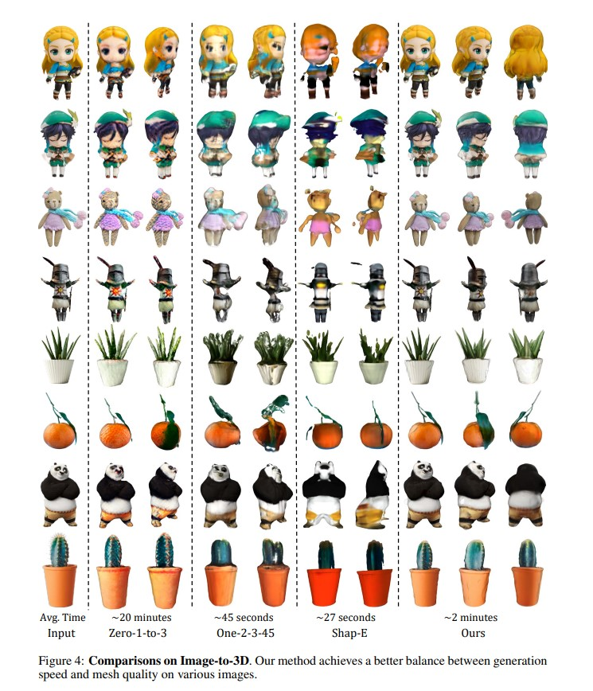

# DreamGaussian (ICML 2024)

## 1.

## 2.

## 3.

## 4. Experiments

### 4.1 Implementation Details

우리는 첫 번째 단계에서 500 스텝, 두 번째 단계에서 50 스텝 동안 학습을 진행합니다. 3D 가우시안은 반지름 0.5의 구 안에 초기 불투명도 0.1과 회색 색상으로 초기화됩니다. Gaussian splatting에서는 렌더링 해상도를 64에서 512로 증가시키며, 메쉬에서는 128에서 1024까지 무작위로 샘플링합니다. RGB와 투명도 손실 가중치는 학습 과정에서 0에서 각각 10⁴와 10³까지 선형적으로 증가합니다. 이미지-3D 변환에서는 고정 반지름 2, 텍스트-3D 변환에서는 반지름 2.5에서 무작위로 카메라 자세를 샘플링합니다. 시야각(FOV)은 y축 기준 49도, 방위각(azimuth)은 [-180, 180]도, 고도(elevation)는 [-30, 30]도 범위에서 샘플링합니다. Gaussian splatting의 배경은 랜덤으로 흰색 또는 검정색으로 렌더링됩니다. 이미지-3D 변환 작업에서는 각 단계가 약 1분 정도 소요됩니다. 입력 이미지는 배경 제거(Qin et al., 2020) 및 전경 객체의 중심을 맞추는 전처리를 거칩니다. 3D 가우시안은 5000개의 무작위 입자로 초기화되고, 매 100 스텝마다 밀도가 높아집니다. 텍스트-3D 변환 작업에서는 Stable Diffusion 모델(Rombach et al., 2022)이 512 × 512의 더 높은 해상도를 사용하므로 각 단계가 약 2분 걸립니다. 이 경우 3D 가우시안은 1000개의 무작위 입자로 초기화되며, 매 50 스텝마다 밀도를 높입니다. 메쉬 추출을 위해 Marching Cubes의 경험적 임계값 1을 사용합니다. 모든 실험은 NVIDIA V100 (16GB) GPU에서 수행되었으며, 우리의 방법은 8GB 이하의 GPU 메모리만 필요합니다. 추가 세부 사항은 보충 자료를 참조하십시오.

 요약:
1. 첫 번째 단계는 500 스텝, 두 번째 단계는 50 스텝으로 학습.
2. 3D 가우시안 초기화: 불투명도 0.1, 회색, 반지름 0.5.
3. Gaussian splatting 해상도: 64 → 512, 메쉬 샘플링: 128 → 1024.
4. 손실 가중치(RGB, 투명도): 학습 중 0 → 10⁴ 및 10³으로 증가.
5. 카메라 설정: 이미지-3D는 반지름 2, 텍스트-3D는 반지름 2.5.
6. 이미지-3D: 약 1분 소요, 텍스트-3D: 약 2분 소요.
7. 3D 가우시안 입자: 이미지-3D는 5000개, 텍스트-3D는 1000개로 시작.
8. 모든 실험은 NVIDIA V100 GPU에서 수행, 8GB 이하 메모리 요구.

### 4.2 Qualitative Comparisons

우리는 먼저 **그림 4**에서 이미지-3D 변환에 대한 정성적 비교를 제공합니다. 우리는 주로 최적화 기반 방법(Liu et al., 2023b)과 추론 기반 방법(Liu et al., 2023a; Jun & Nichol, 2023)과 비교했습니다. 비교한 모든 방법에 대해, 생성된 모델을 다각형 메쉬로 내보내고, 정점 색상 또는 텍스처 이미지를 사용하여 주변 조명 하에서 렌더링했습니다. **생성 속도** 측면에서, 우리의 접근 방식은 다른 최적화 기반 방법에 비해 눈에 띄는 가속을 보였습니다. **생성된 모델의 품질**에 대해서는, 특히 3D 형상 및 시각적 외관의 정확성 면에서 우리 방법이 추론 기반 방법보다 더 우수한 결과를 보여주었습니다. 일반적으로, 우리의 방법은 **생성 품질**과 **속도** 사이에서 더 나은 균형을 이루며, 최적화 기반 방법과 비슷한 품질을 달성하면서도 추론 기반 방법에 비해 다소 느린 속도만을 보였습니다.

~~**그림 5**에서는 텍스트-3D 변환 결과를 비교했습니다. 이미지-3D 작업에서와 마찬가지로, 우리의 방법은 추론 기반 방법보다 더 나은 품질을 달성했고, 다른 최적화 기반 방법보다 더 빠른 속도를 보였습니다.~~ 또한, **그림 6**에서는 내보낸 메쉬의 품질을 강조했습니다. 이러한 메쉬는 균일한 삼각형 분할, 매끄러운 표면 법선, 선명한 텍스처 이미지를 보여주어 후속 애플리케이션에 원활하게 통합될 수 있습니다. 예를 들어, Blender (Community, 2018)와 같은 소프트웨어를 활용하여 이러한 메쉬를 리깅 및 애니메이션 작업에 쉽게 사용할 수 있습니다.

요약:
- 이미지-3D 변환에서 최적화 기반 및 추론 기반 방법들과 비교.
- 생성 속도는 최적화 기반 방법보다 빠르고, 품질은 추론 기반 방법보다 우수함.
- 텍스트-3D 변환에서도 동일한 경향: 품질은 우수하고 속도는 빠름.
- 내보낸 메쉬는 균일한 삼각형 분할, 매끄러운 표면, 선명한 텍스처로 후속 애플리케이션에 적합.
- Blender 등 소프트웨어를 통해 리깅과 애니메이션에 쉽게 활용 가능.

### 4.3 Quantitative Comparisons

**표 1**에서는 이전 연구(Melas-Kyriazi et al., 2023; Liu et al., 2023a; Tang et al., 2023b) 및 인터넷에서 수집한 이미지들을 사용하여, 다양한 이미지-3D 변환 방법의 **CLIP 유사도**(Radford et al., 2021; Qian et al., 2023; Liu et al., 2023a)와 평균 생성 시간을 보고합니다. 또한, **표 2**에서는 생성 품질에 대한 사용자 연구 결과를 제시합니다. 이 연구는 이미지-3D 작업에서 중요한 두 가지 측면인 **참조 뷰 일관성**과 **전체 생성 품질**을 평가하는 데 중점을 둡니다. 우리의 두 단계 결과는 추론 기반 방법에 비해 더 나은 **뷰 일관성**과 **생성 품질**을 달성했습니다. 비록 우리의 메쉬 품질이 다른 최적화 기반 방법에 비해 약간 뒤처지지만, **10배 이상의 속도 향상**을 달성했습니다.

요약:
- **표 1**: 다양한 이미지-3D 변환 방법의 CLIP 유사도와 평균 생성 시간 보고.
- **표 2**: 참조 뷰 일관성과 전체 생성 품질에 대한 사용자 연구 결과 제시.
- 우리의 방법은 추론 기반 방법보다 뷰 일관성과 생성 품질에서 우수함.
- 메쉬 품질은 약간 뒤처지지만, **10배 이상의 속도 향상**을 이룸.